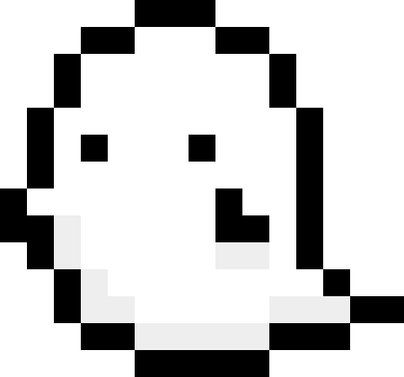

# ぼくとおばけ

本プロジェクトは、ドット風のおばけを放置系シミュレーション型で育成していくアプリケーションの開発を目的とする。  
また、プログラミング未経験者との共同開発を成立させるため、実装単位を小さく分割し、段階的に機能を拡張する方針を採用する。

## ゲーム概要

- ジャンル: 育成 / 放置 + ミニ操作
- テーマ: かわいいお化けを育てる
- ビジュアル: ドット風（低解像度、少色）
- コア体験: 「お世話して、反応を見て、少しずつ成長する」

## 最小実装（MVP）

まずは以下だけ作れば遊べる状態にします。

- お化け1体を表示
- 3つの行動ボタン
  - `ごはん`
  - `あそぶ`
  - `ねる`
- ステータス3種
  - `まんぷく`
  - `ごきげん`
  - `ねむけ`
- 時間経過でステータス変動
- ステータスに応じて表情変化（最低3パターン）

## ゲームループ（想定）

1. プレイヤーが行動を選ぶ
2. ステータスが増減する
3. お化けの見た目 / セリフが変わる
4. 一定条件で成長段階が進む

## アート方針（ドット風）

- 1マスを拡大表示して「粗さ」を味にする
- 色数は少なめ（例: 8〜16色）
- まずは `32x32` or `48x48` のキャラサイズで統一
- 差分は「表情」から作る（体の描き直しを減らす）

## 要件定義

### 機能要件

- おばけ1体を常時表示できること
- 行動入力（`ごはん` `あそぶ` `ねる`）を受け付けられること
- ステータス（`まんぷく` `ごきげん` `ねむけ`）を保持し、操作時に更新できること
- 時間経過に応じてステータスを自動変動させること
- ステータス条件に応じて表情差分を切り替えられること
- セーブ/ロードにより育成状態を復元できること
- 一定条件で成長段階を遷移できること

### 非機能要件

- 初学者との共同開発を前提に、仕様は短文で可読に保つこと
- ドット表現の視認性を維持するため、表示倍率を固定すること
- 主要操作は少ない手順で完了できるUI構成とすること
- ローカル実行時に安定して動作し、致命的エラーで状態を損失しないこと
- 将来的な機能追加（進化分岐、部屋カスタム等）に耐える構造とすること

## ディレクトリ案

未定
